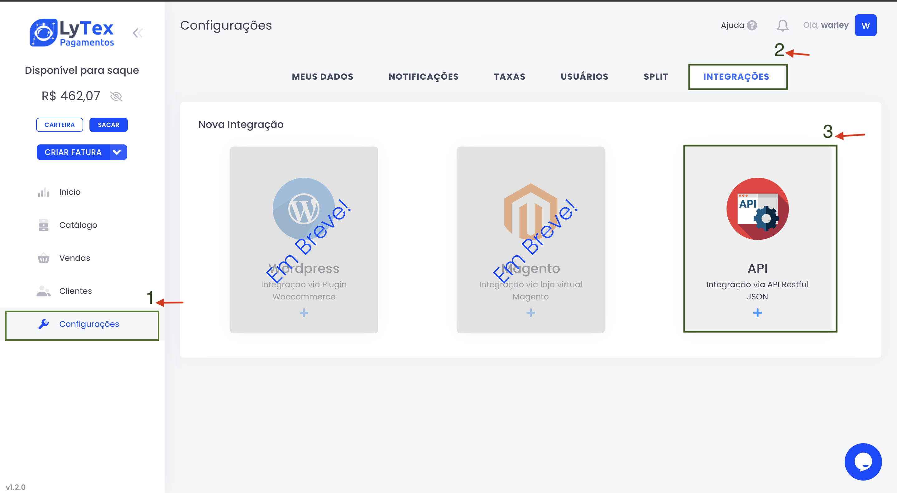

# Criando uma Integração 

Agora vamos criar uma integração no painel, ou seja vamos gerar agora as chaves que vai possibilitar que o nosso método seja integrado. primeiramente faça o [login](https://pay.lytex.com.br/auth/login) no seu painel, em seguida no menu lateral a esquerda clique em **Configurações**
logo em seguida clique em **Integrações**, por fim click em **API**

